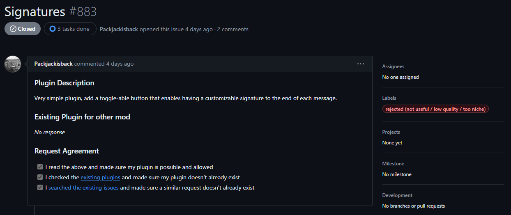
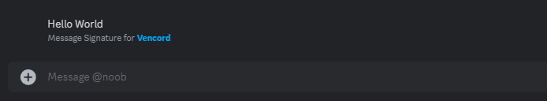
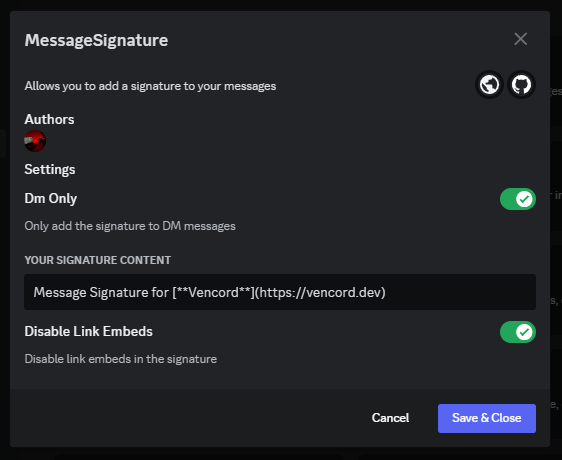

# Thanks to IMXNOOBX for the base code
# 😢 Message Signature
This is a plugin for vencord that adds signatures for your messages, you wont find it in the plugins directory as the request has been denied before i even started working on it, so you will have to install it manually.

## 😔 Denied feature request

[**Here**](https://github.com/Vencord/plugin-requests/issues/883) you can see the denied feature request. My fault not to check the feature requests before starting to work on it. As you can see only 4 days after i started working on it. :c

# 🌳 Preview

# 📦 Installation

> ## Follow the official instructions [*here*](https://docs.vencord.dev/installing/custom-plugins/).
